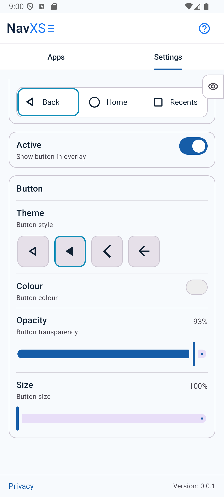
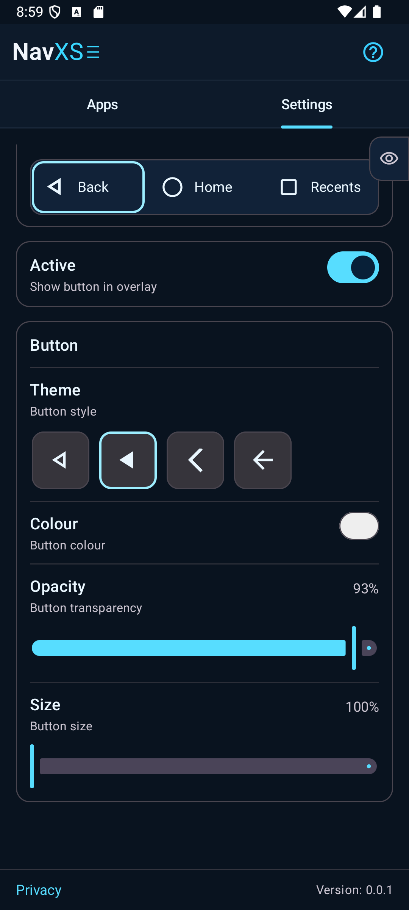
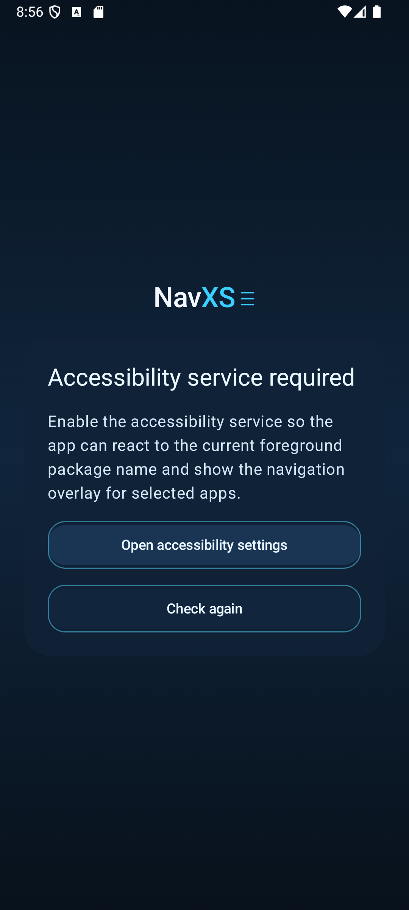
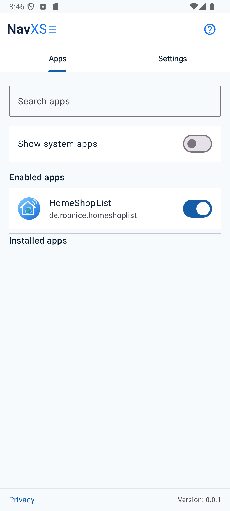
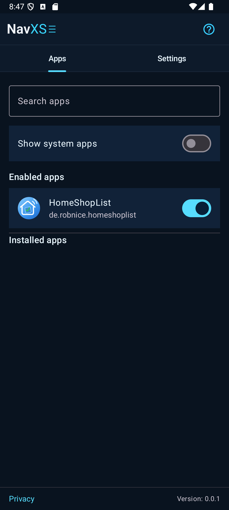
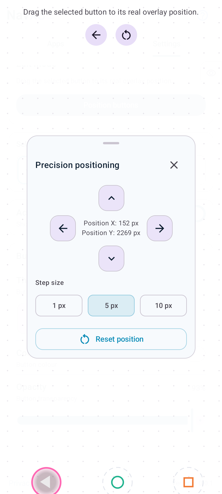
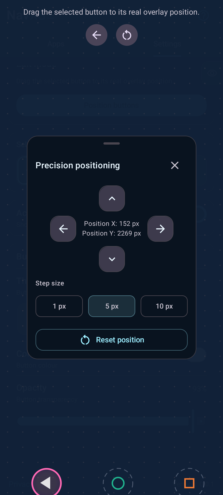
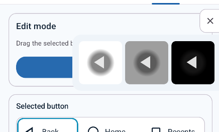
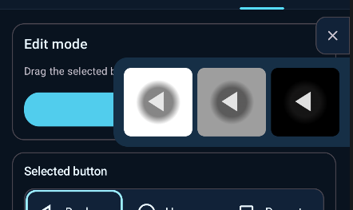

# NavXS

A lightweight Android app that places a floating navigation overlay — **Back**, **Home**, and **Recents** buttons — on top of any app you choose. Ideal for devices where gesture navigation conflicts with a particular app, or when you simply want persistent, fully customisable soft keys exactly where you need them.

  
  &nbsp;&nbsp;&nbsp;
  

**How to get started**

1. Launch NavXS and grant the accessibility service permission.
2. In the **Apps** tab, enable the apps that should display the overlay.
3. In the **Settings** tab, customise each button's appearance and position.
4. Open any enabled app — the overlay appears automatically and hides when you leave.

---

## Contents

1. [Accessibility Service](#1-accessibility-service)
2. [Apps](#2-apps)
3. [Settings](#3-settings)
   - [3.1 Position buttons](#31-position-buttons)
   - [3.2 Select a button](#32-select-a-button)
   - [3.3 Active](#33-active)
   - [3.4 Button](#34-button)
   - [3.5 Button background](#35-button-background)
4. [Preview flag](#4-preview-flag)

---

## 1 Accessibility Service

NavXS uses Android's Accessibility Service to detect which app is currently in the foreground. This is the only mechanism Android provides for an app to know what is running at any given moment — it is required for the overlay to know when to show and when to hide itself.

  

On first launch, this screen appears if the service is not yet enabled. Tap **Open accessibility settings**, locate NavXS in the list, and toggle it on. Return to the app and tap **Check again** to continue.

**What the service does — and does not do**

| | |
|---|---|
| ✅ | Reads the **package name** of the foreground app to decide whether to show the overlay. |
| ❌ | Does **not** read window content, text, or UI elements of other apps (`canRetrieveWindowContent="false"`). |
| ❌ | Does **not** transmit any data. All processing stays on your device. |

The permission can be revoked at any time in **Android Settings → Accessibility → NavXS**.

---

## 2 Apps

  
  &nbsp;&nbsp;&nbsp;
  

The list shows all installed apps on your device. Enable an app to make the NavXS overlay appear whenever it is in the foreground. Use the search bar to filter by name, or toggle **Show system apps** to include system apps.

Enabled apps appear at the top of the list for quick access. Disabling an app removes the overlay the next time that app comes to the foreground.

---

## 3 Settings

All settings apply to the currently selected button only. The three buttons — Back, Home, and Recents — are configured independently of one another.

  
  &nbsp;&nbsp;&nbsp;
  

### 3.1 Position buttons

Opens a full-screen editor where you drag buttons to the exact position they should occupy in the live overlay. Tap a button to select it without moving it. The reset icon (↺) restores all default positions. The precision panel moves the selected button by an exact pixel step size.

  
  &nbsp;&nbsp;&nbsp;
  

The **Precision positioning** panel offers step sizes of 1 px, 5 px, and 10 px and displays the exact pixel coordinates of the selected button in real time.

### 3.2 Select a button

Tap **Back**, **Home**, or **Recents** at the top of the settings screen to pick a button. All settings below apply to the selected button only.

### 3.3 Active

Switches the selected button on or off in the overlay. At least one button must remain active at all times.

### 3.4 Button

| Setting | Description |
|---------|-------------|
| **Theme** | Chooses the icon style. Multiple design variants are available per button. |
| **Colour** | Sets the icon colour. |
| **Opacity** | Icon transparency — 0 invisible, 100 fully opaque. |
| **Size** | Scales the icon relative to its default size. |

### 3.5 Button background

An optional circle drawn behind the icon to improve visibility against any app background.

| Setting | Description |
|---------|-------------|
| **Colour** | Fill colour of the background circle. |
| **Opacity** | Transparency of the background circle. |
| **Size** | Diameter of the circle relative to the icon. |
| **Softness** | 0 = hard edge; 100 = fully faded gradient edge. |

---

## 4 Preview flag

The small flag at the top-right of the settings screen slides open a side panel showing the selected button rendered on white, grey, and black backgrounds. Use it to judge how the button will look on any app background without leaving the settings screen.

  

  

